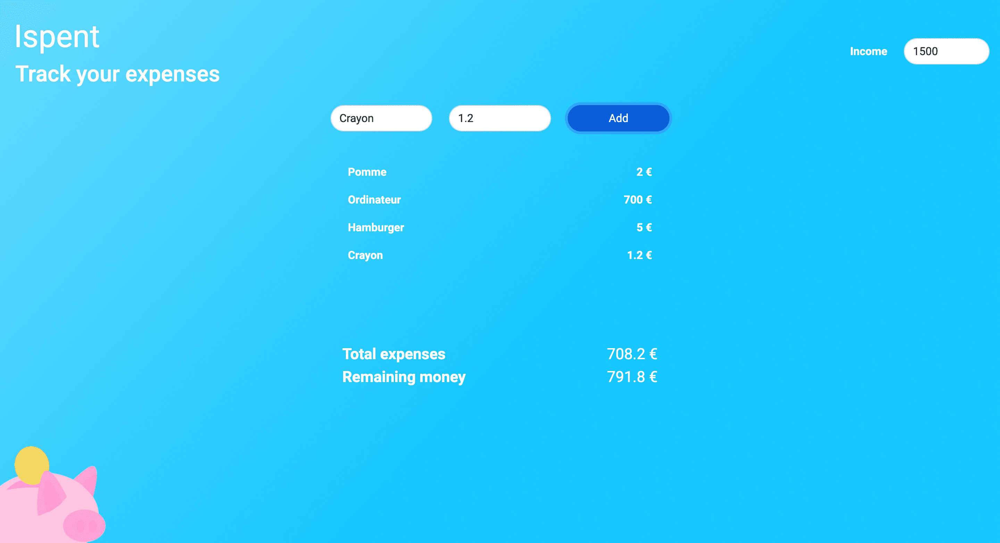

# Ispent

Voici mon application de suivi des dépenses en React.

Lien de l'app : [https://ispent-expense-tracker-react.vercel.app/](https://ispent-expense-tracker-react.vercel.app/)

## Installation
 - Installer les dépendances `npm install`
 - Lancer l'application `npm start`